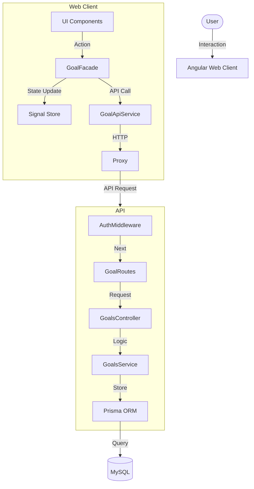

# North Architecture

## Overview

North is a habit tracking and goal management application designed as a monolithic repository (Monorepo) using Nx. It separates concerns strictly using the Facade Pattern on both backend and frontend.

## Diagram

## Key Decisions

### 1. Nx Monorepo

We use Nx to manage both `web-client` (Angular) and `api` (Express) in a single workspace. This allows for:

- Shared types (`libs/shared-types`).
- Unified build and test commands.
- Easier full-stack refactoring.

### 2. Facade Pattern

- **Frontend**: Components never talk to the API service directly. The `GoalFacade` handles state injection (Signals) and API orchestration. This makes components "dumb" and easy to test.
- **Backend**: Controllers are thin. All business logic resides in Services.

### 3. Authentication

- **Strategy**: Google OAuth 2.0 followed by a custom JWT.
- **Flow**: Frontend redirects to Backend -> Backend validates with Google -> Backend issues JWT -> Frontend stores JWT.
- **Security**: All protected routes require `Authorization: Bearer <token>`.

### 4. Synchronization & Automation

- **Real-time**: Optimistic UI updates on the frontend for immediate feedback.
- **Automation**: `node-cron` jobs run on the backend to:
  - Reset streaks at midnight if incomplete (`streak-maintainer.job.ts`).
  - Send push notifications at 20:00 as reminders (`daily-reminder.job.ts`).

### 5. PWA & Notifications

- The web client is a Progressive Web App (PWA).
- Uses Firebase Cloud Messaging (FCM) via `firebase-admin` (Backend) and Firebase SDK (Frontend) for push notifications.
